# Artificial-Intelligence-Lexical
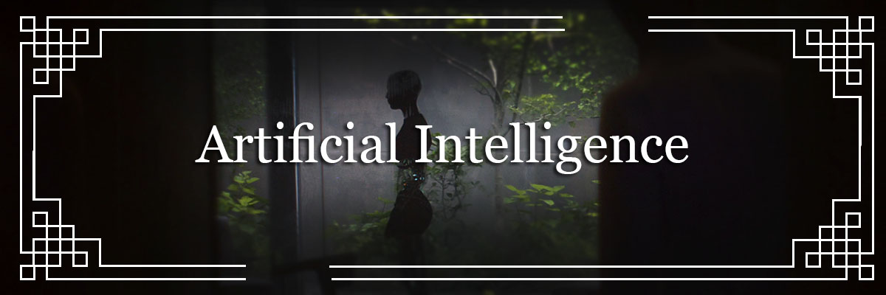

This repository is aiming to regroup most of the definition in the field of AI. Since there is a lot of things to remember, I would advice the use of flashcard if you are new to the field.

## General terms
### Narrow/Weak Artificial Intelligence

Weak artificial intelligence (weak AI), also known as narrow AI, is artificial intelligence that is focused on one narrow task. Weak AI is defined in contrast to strong AI, a machine with the ability to apply intelligence to any problem, rather than just one specific problem, sometimes considered to require consciousness, sentience and mind). Many currently existing systems that claim to use "artificial intelligence" are likely operating as a weak AI focused on a narrowly defined specific problem.

Siri is a good example of narrow intelligence. Siri operates within a limited pre-defined range of functions. There is no genuine intelligence or no self-awareness despite being a sophisticated example of weak AI.

[Wikipedia](https://en.wikipedia.org/wiki/Weak_AI)

### Artificial General Intelligence (Strong AI/True AI)

Artificial general intelligence (AGI) is the intelligence of a machine that has the capacity to understand or learn any intellectual task that a human being can. It is a primary goal of some artificial intelligence research and a common topic in science fiction and future studies. Some researchers refer to Artificial general intelligence as "strong AI", "full AI" or as the ability of a machine to perform "general intelligent action"; others reserve "strong AI" for machines capable of experiencing consciousness.

Some references emphasize a distinction between strong AI and "applied AI" (also called "narrow AI" or "weak AI"): the use of software to study or accomplish specific problem solving or reasoning tasks. Weak AI, in contrast to strong AI, does not attempt to perform the full range of human cognitive abilities.
[Wikipedia](https://en.wikipedia.org/wiki/Artificial_general_intelligence)

On a side note, here is the 3 theory of consciousness that are taken seriously by the neurology community:
- [global workspace theory](https://en.wikipedia.org/wiki/Global_workspace_theory)
- biological theory of consciousness
- [Higher order theory of consciousness](https://en.wikipedia.org/wiki/Higher-order_theories_of_consciousness)

_________
## Layers
legend
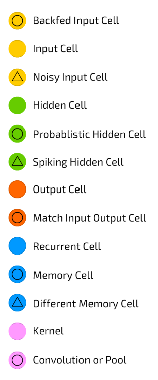
________
## Activation function
The activation function of a node defines the output of that node given an input or set of inputs.
[wikipedia](https://en.wikipedia.org/wiki/Activation_function)
### Cross Validation

### Regularisation

### Dropout
**i.e** Dropout is a method that allow you to "turn off" some of the neurones randomly. the most common dropout probability for a layer is 0.5 but it can be tune at will.

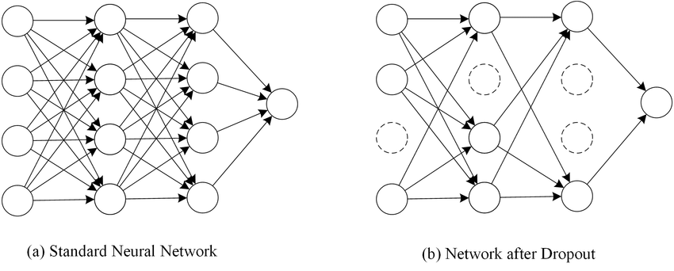

### Overfitting (high variance) and Underfitting (High bias)
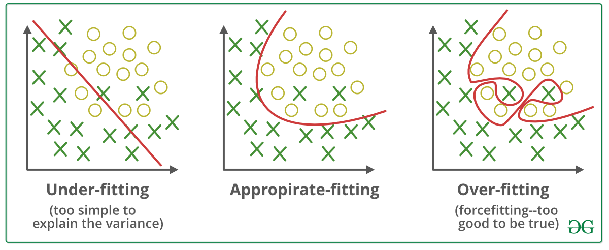

## Gradient descent

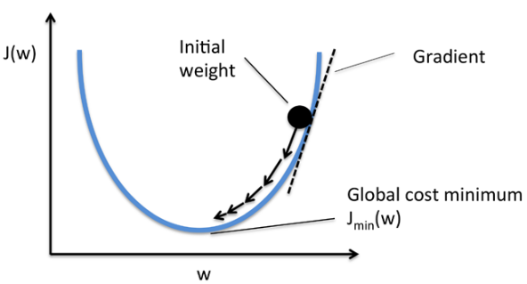

### Stochastic gradient descent (SGD)
In both gradient descent (GD) and stochastic gradient descent (SGD), you update a set of parameters in an iterative manner to minimize an error function.

While in GD, you have to run through ALL the samples in your training set to do a single update for a parameter in a particular iteration, in SGD, on the other hand, you use ONLY ONE or SUBSET of training sample from your training set to do the update for a parameter in a particular iteration. If you use SUBSET, it is called Minibatch Stochastic gradient Descent.

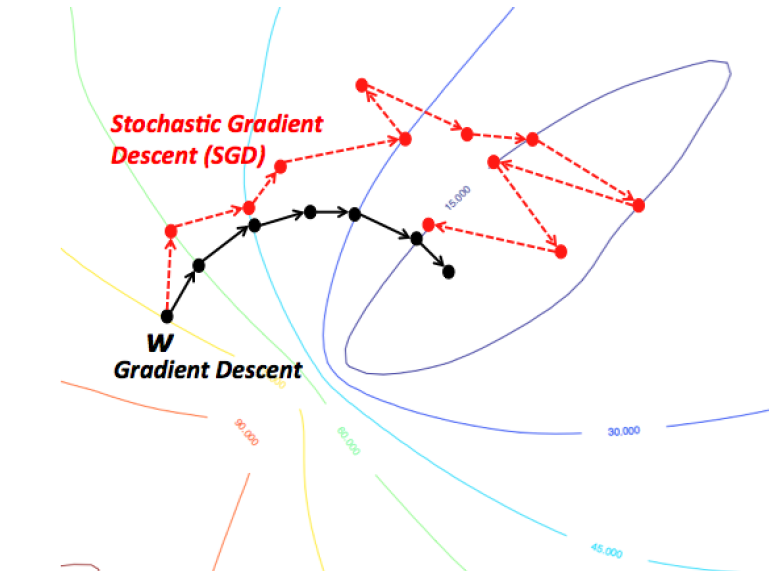

Thus, if the number of training samples are large, in fact very large, then using gradient descent may take too long because in every iteration when you are updating the values of the parameters, you are running through the complete training set. On the other hand, using SGD will be faster because you use only one training sample and it starts improving itself right away from the first sample.

SGD often converges much faster compared to GD but the error function is not as well minimized as in the case of GD. Often in most cases, the close approximation that you get in SGD for the parameter values are enough because they reach the optimal values and keep oscillating there.

If you need an example of this with a practical case, check Andrew NG's notes here where he clearly shows you the steps involved in both the cases. cs229-notes
[source](https://datascience.stackexchange.com/questions/36450/what-is-the-difference-between-gradient-descent-and-stochastic-gradient-descent)
______________________________

## Categories of machine learning

### Unsupervised Learning
Unsupervised learning is a type of self-organized Hebbian learning that helps find previously unknown patterns in data set without pre-existing labels. It is also known as self-organization and allows modelling probability densities of given inputs. It is **one of the main three categories of machine learning, along with supervised and reinforcement learning.**

[Wikipedia](https://en.wikipedia.org/wiki/Unsupervised_learning)
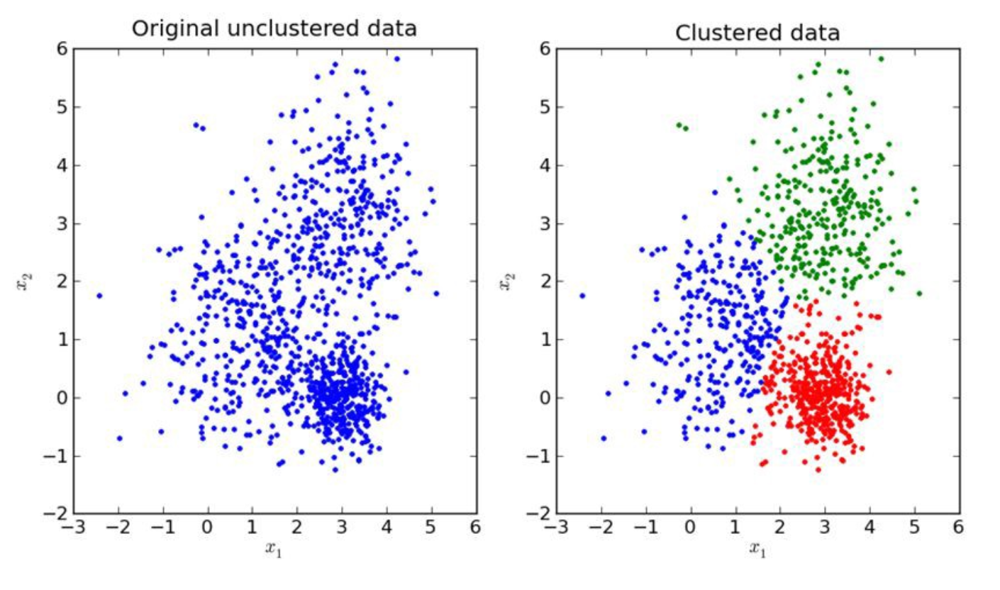

the four main task of unsupervised learning are:
 - **Dimensionality reduction**

 - **Clustering**

Group similar instance together into *cluster*
 - **Anomaly detection**

Learn what a "normal" data look like, and use it to detect abnormal instances.

 - **Density estimation**

 Estimating how isolated a data is. *i.g* instance located in low density region are likely to be Anomaly. it is usefull for *data analysis, data visualisation and anomaly detection*.

#### Clustering
*(page 237)* Used for :
- Customer segmentation
- Data analysis
- Dimensionality reduction
- Anomaly detection
- Semi-supervised learning
- Search engines (similar image search)
- Segment an image

#### K-Means
- how does it work ?

1) Centroids are assigned randomly

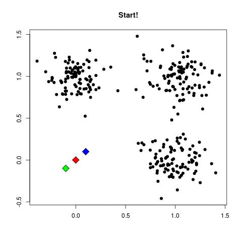
- what about it's complexity ?
K-means is **generally linear** with regard to m, k, n. However if the structure does not have a clustering structure it can increase exponentially but it is rarely the case, generally speaking K-Means is one of the fastest clustering algorithms.

- What are the disadvantage?

1) Kmeans tries to create same sized cluster no matter how the data is scattered
2) Kmeans doesnt work well for non-globular structures
3) Kmeans doesnt care about how dense the data is present
4) Curse of dimensionality affects kmeans at high dimension since it uses distance measure

#### DBSCAN
DBSCAN is meant to use

#### Auto encoder
"An autoencoder is a type of artificial neural network used to learn efficient data codings in an unsupervised manner.[1] The aim of an autoencoder is to learn a representation (encoding) for a set of data, typically for dimensionality reduction, by training the network to ignore signal “noise”. Along with the reduction side, a reconstructing side is learnt, where the autoencoder tries to generate from the reduced encoding a representation as close as possible to its original input, hence its name."
[source][https://en.wikipedia.org/wiki/Autoencoder]

"Auto encoder are just neural network where the target output is the input."

### Semi-Supervised Learning
Semi-supervised is a hybridization of supervised and unsupervised techniques.

### Supervised Learning
Supervised learning is the machine learning task of learning a function that maps an input to an output based on example input-output pairs. It infers a function from labelled training data consisting of a set of training examples. In supervised learning, each example is a pair consisting of an input object (typically a vector) and a desired output value (also called the supervisory signal). A supervised learning algorithm analyses the training data and produces an inferred function, which can be used for mapping new examples. An optimal scenario will allow for the algorithm to correctly determine the class labels for unseen instances. This requires the learning algorithm to generalize from the training data to unseen situations in a "reasonable" way (see inductive bias).

The parallel task in human and animal psychology is often referred to as concept learning.
[Wikipedia](https://en.wikipedia.org/wiki/Supervised_learning)
______
## Architectures
### ANN (Artificial Neural Network)
Artificial neural networks (ANN) or connectionist systems are computing systems that are inspired by, but not necessarily identical to, the biological neural networks that constitute animal brains. Such systems "learn" to perform tasks by considering examples, generally without being programmed with any task-specific rules. For example, in image recognition, they might learn to identify images that contain cats by analysing example images that have been manually labelled as "cat" or "no cat" and using the results to identify cats in other images. They do this without any prior knowledge about cats, for example, that they have fur, tails, whiskers and cat-like faces. Instead, they automatically generate identifying characteristics from the learning material that they process.

An ANN is based on a collection of connected units or nodes called artificial neurons, which loosely model the neurons in a biological brain. Each connection, like the synapses in a biological brain, can transmit a signal from one artificial neuron to another. An artificial neuron that receives a signal can process it and then signal additional artificial neurons connected to it.

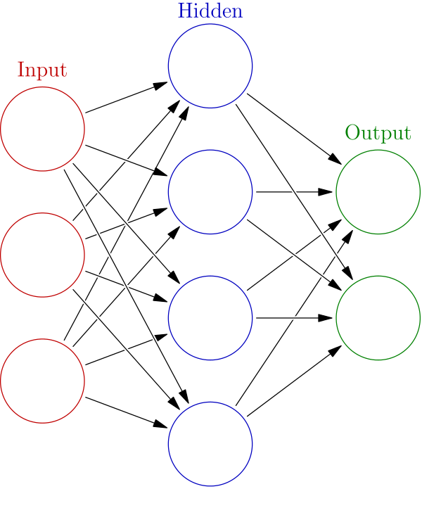
### Perceptron

- Category : Supervised learning

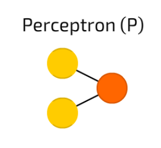

The perceptron is one of the very first algorithms of machine learning, and the most simple artificial neural network.

### MLP (Multilayer Perceptron)

[Good video explanation](https://www.youtube.com/watch?v=u5GAVdLQyIg)
### Feed Forward (FF)
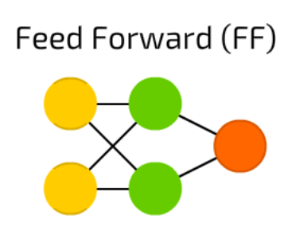
### Radial Basis Function Network
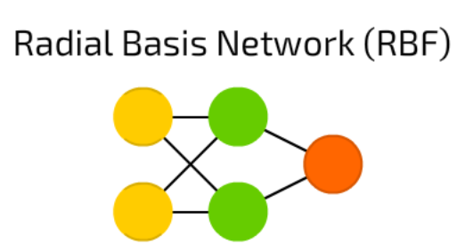
### CNN (Convolutional Neural Network)
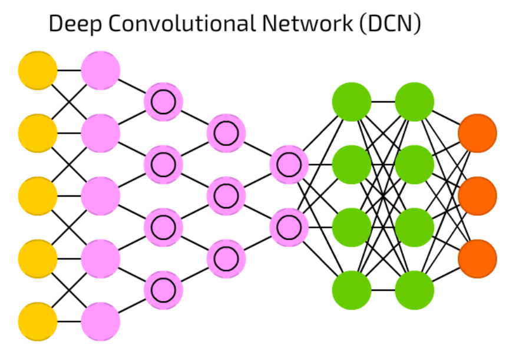
#### Filter / kernel
In a CNN the filters contain the weight
#### Stride
#### Padding
What?
- Padding is a technique that add border of x number of pixel on an image
Why?
- To allowed to do convolution without loosing pixel on the image itself.
how ?

#### Max pooling

**What does it do?**
Applying max pooling on a matrix will reduce the size of the given image/matrix.

**Why ?**
This is done to in part to help over-fitting by providing an abstracted form of the representation. As well, it reduces the computational cost by reducing the number of parameters to learn and provides basic translation invariance to the internal representation.

- it is quicker than convoluting

**How exactly?**
Forward propagation :
Just store the maximum value highlighted by your filter at each step :

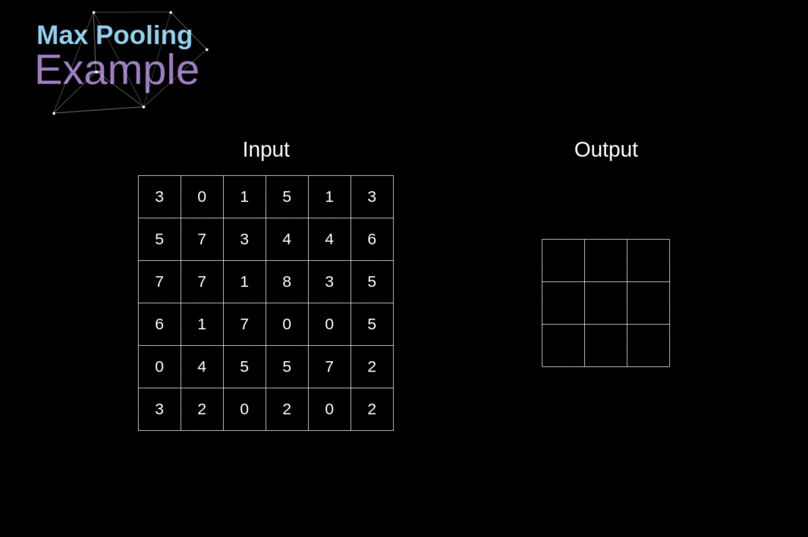

Backpropagation:
Resituate the maximum value that were stored precedently in their respective place and zeroed out the other cell.

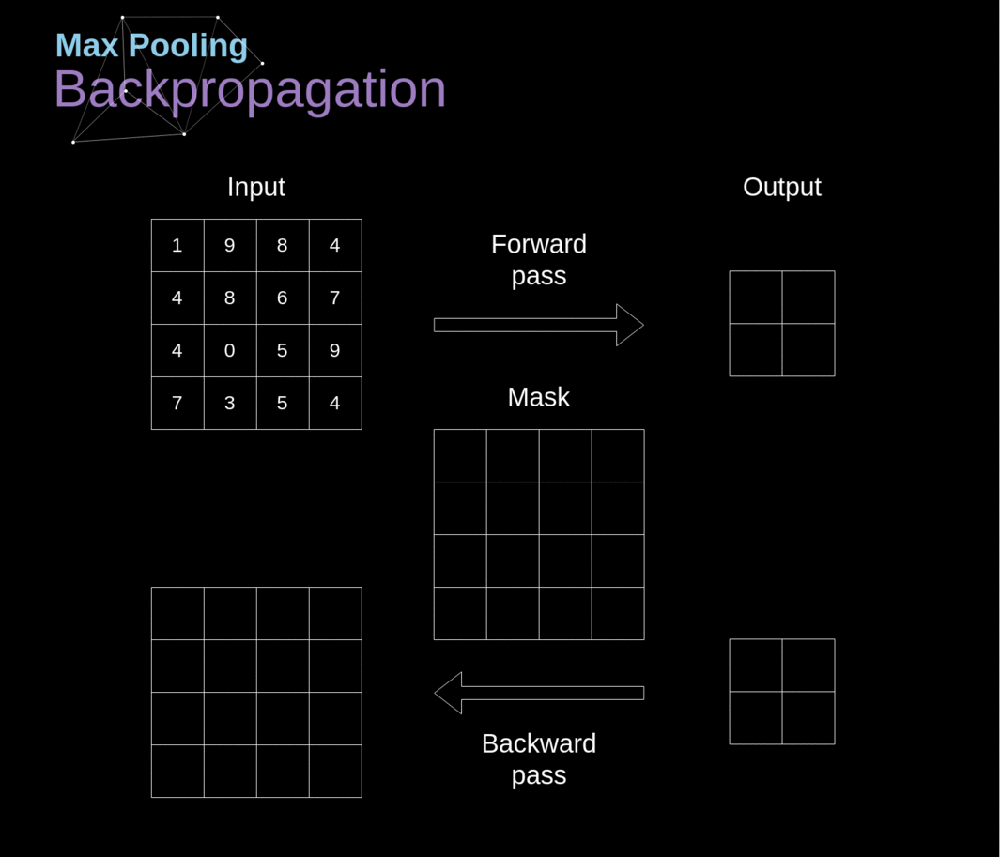

Now the question is "ok, but how do I remember their place of I only have the max number?"

In practice, this is achieved by creating a mask that remembers the position of the values used in the first phase, which we can later utilize to transfer the gradients.

**example ?**

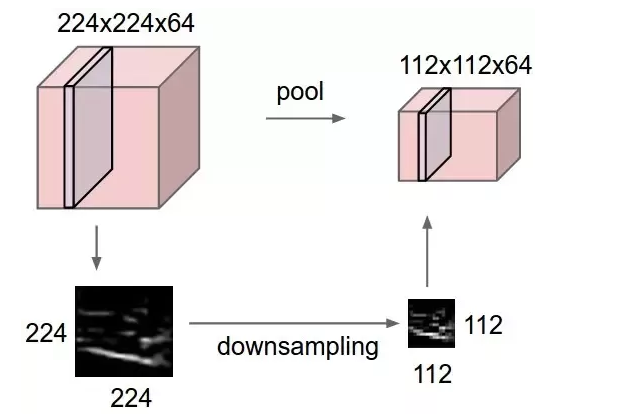
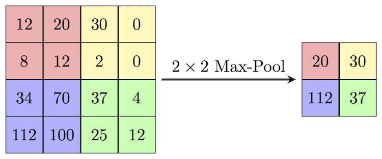

**Some anecdote?**
There are multiple pooling technique
- Max pooling: The maximum pixel value of the batch is selected.
- Min pooling: The minimum pixel value of the batch is selected.
- Average pooling: The average value of all the pixels in the batch is selected.

max pooling can apparently be replaced with a convolutional layer with increased stride without loss in accuracy. it is described in this paper : https://arxiv.org/pdf/1412.6806.pdf

#### Average pooling

### RNN (Recurrent Neural Network)

**What is a recurrent neural network ?**
- A recurrent neural network use the weight of the previous occurrence.

**How does it work exactly ?**
- During the forward propagation the weight of the hidden layer are the one from the previous layer.

Note: Stochastic gradient descent apparently don't work well with RNN

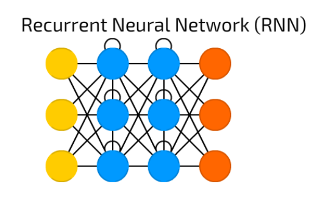

#### LSTM (Long Short Term Memory)
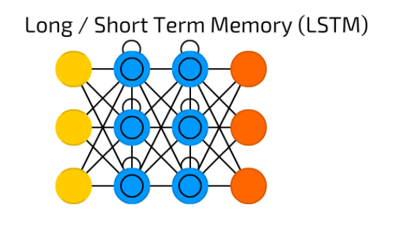
[Wikipedia](https://en.wikipedia.org/wiki/Long_short-term_memory) |
[The paper](https://www.bioinf.jku.at/publications/older/2604.pdf)

#### GRU (Gated Recurrent Unit)
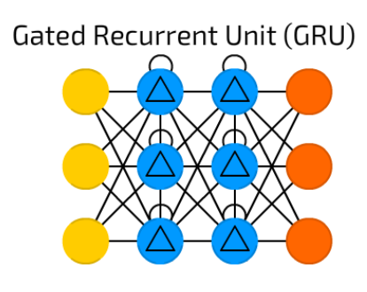

#### Markov chain
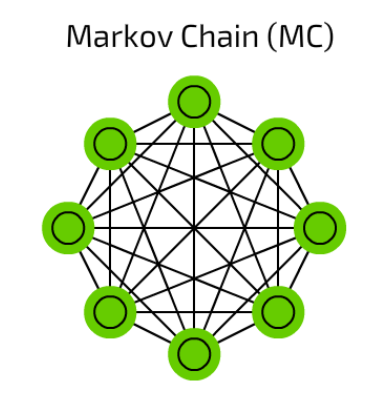
#### Hopfield network

- Category : unsupervised machine learning

The Hopfield network is an [Auto-associative Memory Network](https://en.wikipedia.org/wiki/Autoassociative_memory)

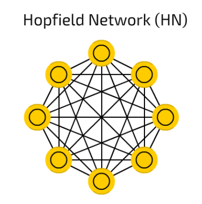

### Boltzmann Machine Network
- Category : unsupervised machine learning

### GAN (Generative adversarial network)
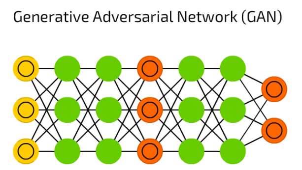
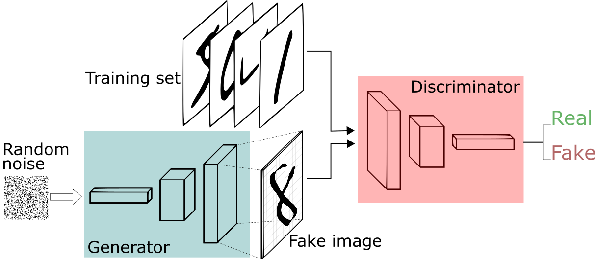

[paper](https://arxiv.org/pdf/1406.2661.pdf)

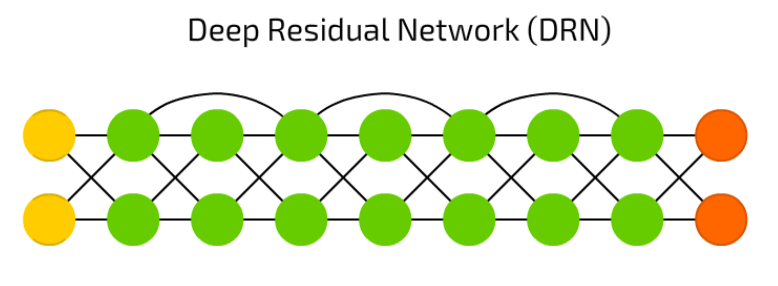

# Conclusion

https://towardsdatascience.com/the-mostly-complete-chart-of-neural-networks-explained-3fb6f2367464
# other
autoML

# Question

* Whet is the difference between Artificial Neural Network and deep learning?
  

  
Answer

  

* What are the pros and cons of supervised vs unsupervised learning ?
  

  
Answer

  **Supervised**
  - More accurate
  - Labelled data required
  - Requires human in the loop

  **Unsupervised**
  - Less accurate
  - No labelled data required
  - Minimal human effort
  

# Most interesting stack overflow thread I saw:
- [Is running more epoch really a direct cause of Overfitting ?](https://ai.stackexchange.com/questions/17287/is-running-more-epochs-really-a-direct-cause-of-overfitting)
This thread made me realise that if you want to know if you tuned your hyperparameter properly you should run as much epoch as possible. if it does not overfit then you won.
